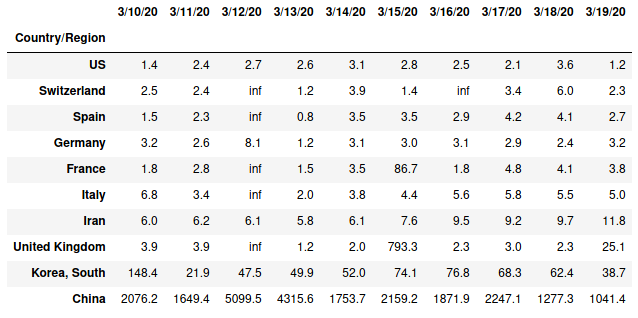
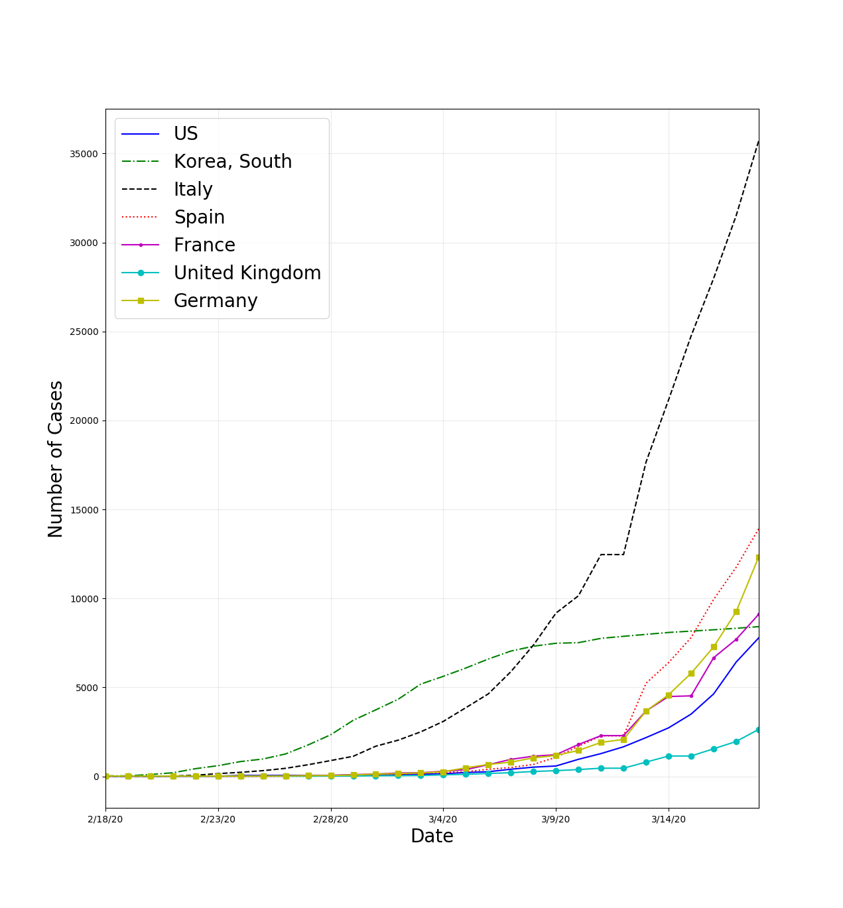

# covid19-numbers

Simple analysis of the covid 19 data supplied by the *Johns Hopkins University Center for Systems Science and Engineering* ([JHU CSSE](https://github.com/CSSEGISandData/COVID-19)).  The jupyter notebook file in this repo will pull down the data and generate the information below.  The code is also available as a python file.

&ensp;

### The purpose of this repo is to increase my own personal understanding of the pandemic.

&ensp;

The tables below only show the ten countries with the highest number of cases.

&ensp;

Estimate of the case fatality rate (CFR) by country. *Remember that the CFR can be skewed by the number of cases.

artificially high because there are lots of cases that have not been reported yet.*

&ensp;

Estimate of the case doubling time by country for the past 10 days.

&ensp;

The number of cases vs time for select countries.

