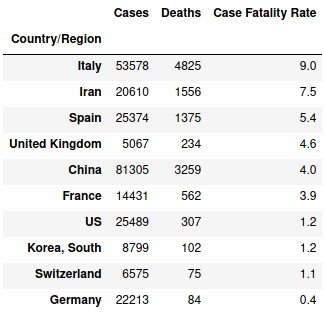
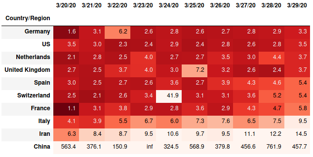
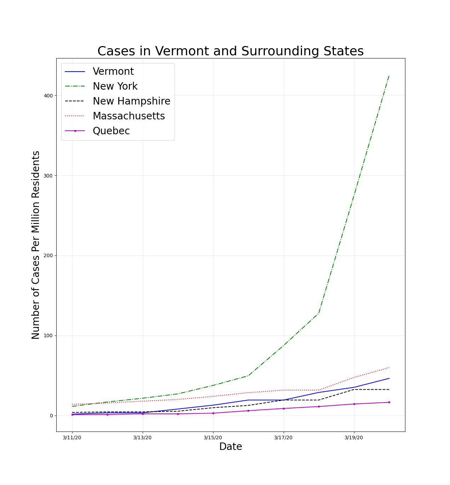
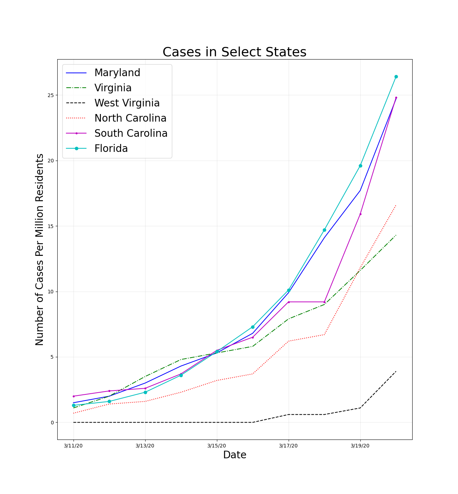

# covid19-numbers

Simple analysis of the COVID-19 data supplied by the *Johns Hopkins University Center for Systems Science and Engineering* ([JHU CSSE](https://github.com/CSSEGISandData/COVID-19)).  The jupyter notebook files in this repo will pull down the data and generate the information below.

&ensp;

### The purpose of this repo is to increase my own personal understanding of the pandemic.

&ensp;

Estimate of the case fatality rate (CFR) as a percentage for the ten countries with the highest number of cases. *Remember that the CFR can be skewed by the number of cases, e.g., if the number of cases was under reported by half this would double the CFR.*

&ensp;

Estimate of the doubling time in days for **cases** by country over the past 10 days.

&ensp;

Estimate of the doubling time in days for **deaths** by country over the past 10 days.

&ensp;

The number of cases vs time for select countries.

<!--
&ensp;

The number of cases vs time for Vermont and surrounding states.

&ensp;

The number of cases vs time for select states.

&ensp;
-->

**Context:** The CDC estimates that somewhere between 26,339 and 52,664 people died from the flu last year (source: https://www.cdc.gov/flu/about/burden/index.html).  This would equate to about 100 deaths per day if we assume that 36,500 people died and those deaths were spread out evenly over the entire year.

