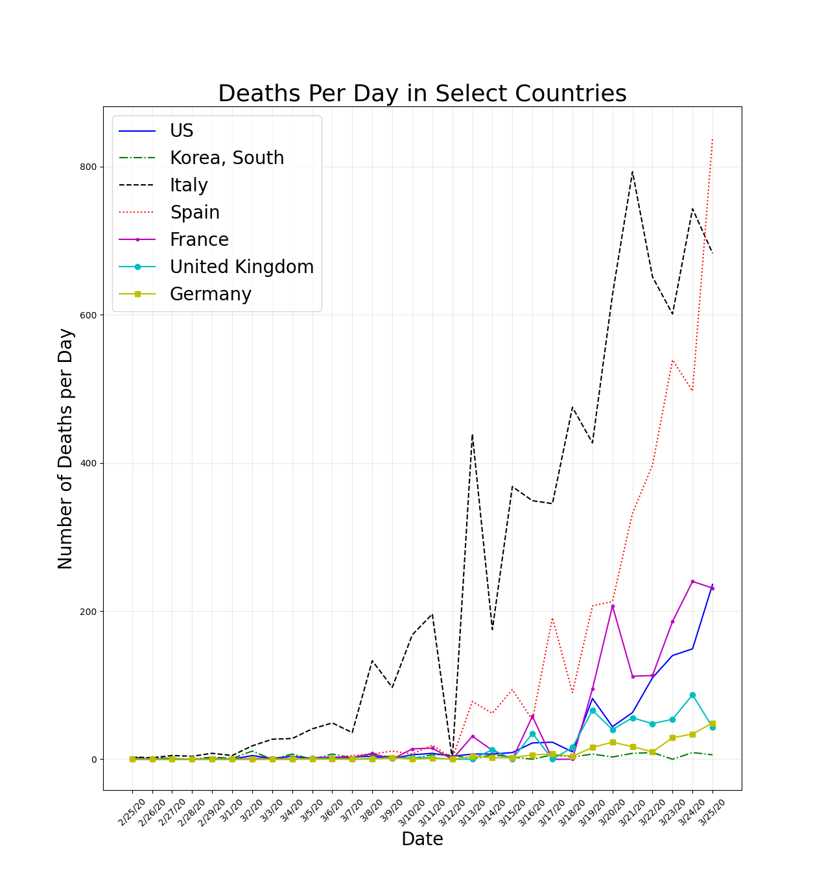

Estimate of the case fatality rate (CFR) as a percentage for the ten countries with the highest number of cases.  The list is sorted by the CFR. *Remember that the CFR can be skewed by the number of cases, e.g., if the number of cases was under-reported by half this would double the CFR.*

&ensp;

Estimate of the doubling time in days for **cases** by country over the past 14 days.

&ensp;

Estimate of the doubling time in days for **deaths** by country over the past 14 days.

&ensp;

The number of cases vs time for select countries.

&ensp;

**Context:** The CDC estimates that somewhere between 26,339 and 52,664 people died from the flu last year (source: https://www.cdc.gov/flu/about/burden/index.html).  This would equate to about 100 deaths per day if we assume that 36,500 people died and those deaths were spread out evenly over the entire year.  If we assume that the deaths were spread out over the peak months of the flu season (Dec. to March) this would equate to about 300 deaths per day.

&ensp;

The number of deaths per day for select countries.

