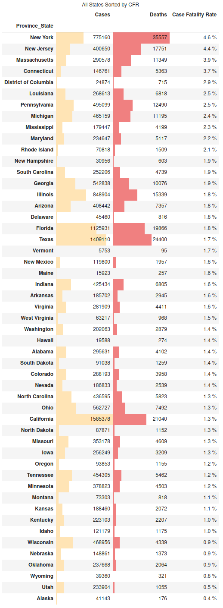
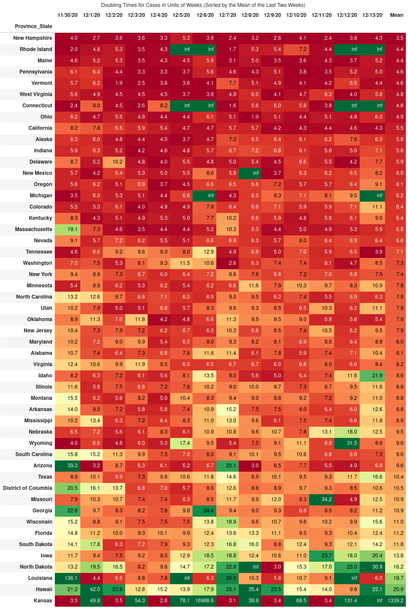
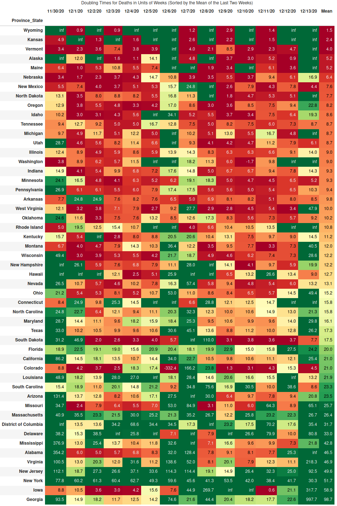
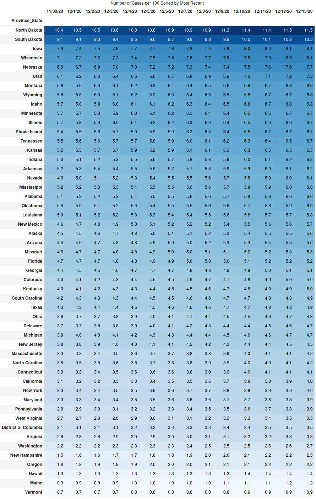
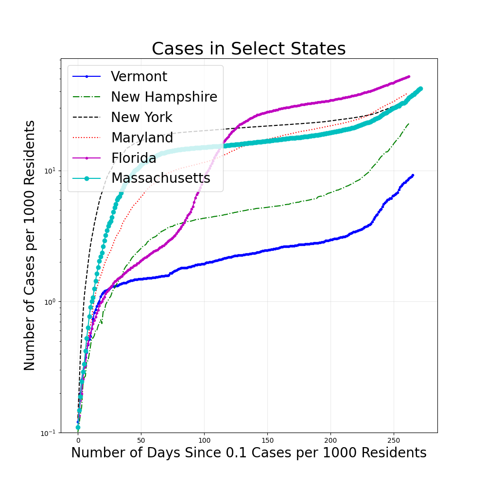
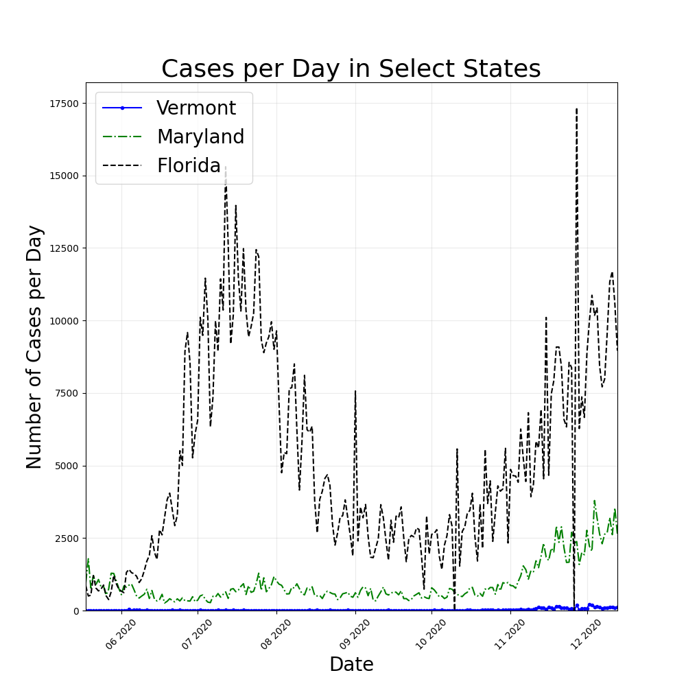

# US Summary

CFR.

&ensp;

Doubling times for cases.

&ensp;

Doubling times for deaths.

&ensp;

Cases per 1000 residents.

&ensp;

Cases per million residents on log scale.

&ensp;

Cases per day for select states.

&ensp;

Treemap plot of deaths per state.

